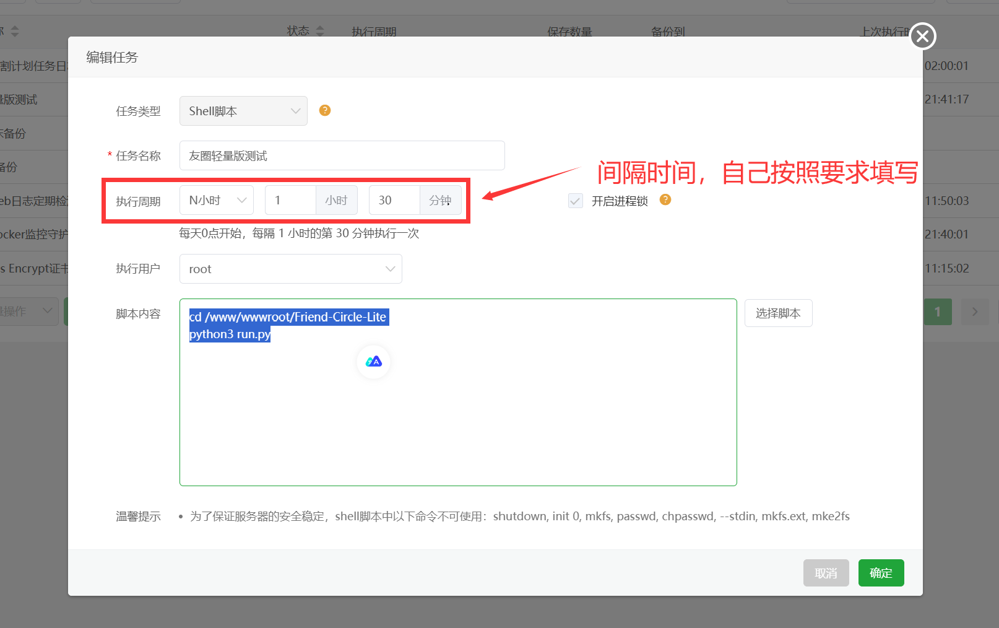

---


# Friend-Circle-Lite

[前端展示](https://fc.liushen.fun) | [详细文档](https://blog.qyliu.top/posts/4dc716ec/)

友链朋友圈简单版，实现了[友链朋友圈](https://github.com/Rock-Candy-Tea/hexo-circle-of-friends)的基本功能，能够定时爬取rss文章并输出有序内容，为了较好的兼容性，输入格式与友链朋友圈的json格式一致，为了轻量化，暂不支持从友链页面自动爬取，下面会附带`hexo-theme-butterfly`主题的解决方案，其他主题可以类比。

## 开发进度

### 2024-08-28

* 日常维护，修复issue中提出的时间为空导致错误的情况，使用更新时间代替

### 2024-08-11

* 添加服务器部署的情况下，合并github结果的选项
* 由于复杂性，决定将服务和定时抓取分开，使用面板自带进行配置，防止小白无法配置
* 修改文档，添加自部署部分

<details>
<summary>查看更多</summary>

<h3>2024-08-03</h3>

* 将自部署分离为API服务和定时爬取
* 尝试更加系统的启动脚本
* 删除server.py中的爬取内容，使用定时任务crontab实现

<h3>2024-07-28</h3>

* 自部署添加跨域请求 
* 修复内存占用异常问题
* 将html资源分开存放，实现更加美观的页面

<h3>2024-07-26</h3>

* 自部署添加跨域请求 
* 添加`/rss.xml`，`/feed/`，`feed.xml`接口的爬取，提高兼容性
* 修复PJAX下会多次出现模态框的问题，并且切换页面不消失
* 修复模态框宽度问题，添加日历图标以更加美观

<h3>2024-07-25</h3>

* 自部署正在开发中，仅供测试
* 添加`/errors.json`，用于获取丢失友链数据，提高自定义程度
* 添加`/index.xml`接口的爬取，提高兼容性
</details>


## 展示页面

* [清羽飞扬の友链朋友圈](https://blog.liushen.fun/fcircle/)

* [❖星港◎Star☆ 的友链朋友圈](https://blog.starsharbor.com/fcircle/)
* 欢迎更多

## 项目介绍

- **爬取文章**: 爬取所有友链的文章，结果放置在根目录的all.json文件中，方便读取并部署到前端。
- **邮箱推送更新(对作者推送所有友链更新)**: 作者可以通过邮箱订阅所有rss的更新（未来开发）。
- **issue邮箱订阅(对访客实时推送最新文章邮件)**: 基于`GitHub issue`的博客更新邮件订阅功能，游客可以通过简单的提交`issue`进行邮箱订阅站点更新，删除对应`issue`即可取消订阅。

## 特点介绍

* **轻量化**：对比原版友链朋友圈的功能，该友圈功能简洁，去掉了设置和fastAPI的臃肿，仅保留关键内容。
* **无数据库**：因为内容较少，我采用`json`直接存储文章信息，减少数据库操作，提升`action`运行效率。
* **部署简单**：原版友链朋友圈由于功能多，导致部署较为麻烦，本方案仅需简单的部署action即可使用，vercel仅用于部署前端静态页面和实时获取最新内容。
* **文件占用**：对比原版`4MB`的`bundle.js`文件大小，本项目仅需要`5.50KB`的`fclite.min.js`文件即可轻量的展示到前端。

## 功能概览

* 文章爬取
* 暗色适配
* 显示作者所有文章
* 获取丢失友链数据
* 随机钓鱼
* 邮箱推送
* 美观邮箱模板
* 自部署(2024-08-11添加)

## action部署使用方法

### 前置工作

1. **Fork 本仓库:**
   点击页面右上角的 Fork 按钮，将本仓库复制到你自己的`GitHub`账号下。

2. **配置 Secrets:**
   在你 Fork 的仓库中，依次进入 `Settings` -> `Secrets` -> `New repository secret`，添加以下 Secrets：
   - `PAT_TOKEN`: GitHub 的个人访问令牌，用于访问 GitHub API。
   - `SMTP_PWD`: SMTP 服务器的密码，用于发送电子邮件。

   
   
2. **配置action权限：**
   
   在设置中，点击`action`，拉到最下面，勾选`Read and write permissions`选项并保存，确保action有读写权限。
   
3. **启用 GitHub Actions:**
   GitHub Actions 已经配置好在仓库的 `.github/workflows/*.yml` 文件中，当到一定时间时将自动执行，也可以手动运行。
   其中，每个action功能如下：
   
   - `friend_circle_lite.yml`实现核心功能，爬取并发送邮箱；
   - `deal_subscribe_issue.yml`处理固定格式的issue，打上固定标签，评论，并关闭issue；
   
4. **设置issue格式：**
   这个我已经设置好了，你只需要检查issue部分是否有对应格式即可，可以自行修改对应参数以进行自定义。

### 配置选项

1. 如果需要修改爬虫设置或邮件模板等配置，需要修改仓库中的 `config.yaml` 文件：

   - **爬虫相关配置**
     使用 `requests` 库实现友链文章的爬取，并将结果存储到根目录下的 `all.json` 文件中。
     
     ```yaml
     spider_settings:
       enable: true
       json_url: "https://blog.qyliu.top/friend.json"
       article_count: 5
       merge_result:
         enable: true
         merge_json_url: "https://fc.liushen.fun"
     ```
     
     `enable`：开启或关闭，默认开启；
     
     `json_url`：友链朋友圈通用爬取格式第一种（下方有配置方法）;
     
     `article_count`：每个作者留存文章个数。

     `marge_result`：是否合并多个json文件，若为true则会合并指定网络地址和本地地址的json文件
     
     - `enable`：是否启用合并功能，该功能提供与自部署的友链合并功能，可以解决服务器部分国外网站，服务器无法访问的问题
     
     - `marge_json_path`：请填写网络地址的json文件，用于合并，不带空格！！！
     
   - **邮箱推送功能配置**
     暂未实现，预留用于将每天的友链文章更新推送给指定邮箱。
     
     ```yaml
     email_push:
       enable: false
       to_email: recipient@example.com
       subject: "今天的 RSS 订阅更新"
       body_template: "rss_template.html"
     ```
     
     **暂未实现**：该部分暂未实现，由于感觉用处不大，保留接口后期酌情更新。
     
   - **邮箱 issue 订阅功能配置**
     通过 GitHub issue 实现向提取的所有邮箱推送博客更新的功能。
     
     ```yaml
     rss_subscribe:
       enable: true
       github_username: willow-god
       github_repo: Friend-Circle-Lite
       your_blog_url: https://blog.qyliu.top/
     ```
     
     `enable`：开启或关闭，默认开启，如果没有配置请关闭。
     
     `github_username`：github用户名，用来拼接github api地址
     
     `github_repo`：仓库名称，作用同上。
     
     `your_blog_url`：用来定时检测是否有最新文章。
     
   - **SMTP 配置**
     使用配置中的相关信息实现邮件发送功能。
     
     ```yaml
     smtp:
       email: 3162475700@qq.com
       server: smtp.qq.com
       port: 587
       use_tls: true
     ```
     
     `email`：发件人邮箱地址
     
     `server`：`SMTP` 服务器地址
     
     `port`：`SMTP` 端口号
     
     `use_tls`：是否使用 `tls` 加密
     
     这部分配置较为复杂，请自行学习使用。

2. **贡献与定制:**
   欢迎对仓库进行贡献或根据需要进行定制。

### 友圈json生成

1. 将以下文件放置到博客根目录：

   ```javascript
   const YML = require('yamljs')
   const fs = require('fs')
   
   let friends = [],
       data_f = YML.parse(fs.readFileSync('source/_data/link.yml').toString().replace(/(?<=rss:)\s*\n/g, ' ""\n'));
   
   data_f.forEach((entry, index) => {
       let lastIndex = 2;
       if (index < lastIndex) {
           const filteredLinkList = entry.link_list.filter(linkItem => !blacklist.includes(linkItem.name));
           friends = friends.concat(filteredLinkList);
       }
   });
   
   // 根据规定的格式构建 JSON 数据
   const friendData = {
       friends: friends.map(item => {
           return [item.name, item.link, item.avatar];
       })
   };
   
   // 将 JSON 对象转换为字符串
   const friendJSON = JSON.stringify(friendData, null, 2);
   
   // 写入 friend.json 文件
   fs.writeFileSync('./source/friend.json', friendJSON);
   
   console.log('friend.json 文件已生成。');
   ```

2. 在根目录下运行：

   ```bash
   node link.js
   ```

   你将会在source文件中发现文件`friend.json`，即为对应格式文件，下面正常hexo三件套即可放置到网站根目录。

3. (可选)添加运行命令到脚本中方便执行，在根目录下创建：

   ```bash
   @echo off
   E:
   cd E:\Programming\HTML_Language\willow-God\blog
   node link.js && hexo g && hexo algolia && hexo d
   ```

   地址改成自己的，上传时仅需双击即可完成。

   如果是github action，可以在hexo g脚本前添加即可完整构建，注意需要安装yaml包才可解析yml文件。

## 部署到网页

首先，将该项目部署到vercel，部署到vercel的目的主要是利用vercel检测仓库并实时刷新的功能，及时获取all.json文件内容。任意平台均可。

部署完成后，你将获得一个地址，建议自行绑定域名。

在前端页面的md文件中写入：

```html
<div id="friend-circle-lite-root"></div>
<script>
    if (typeof UserConfig === 'undefined') {
        var UserConfig = {
            // 填写你的fc Lite地址
            private_api_url: 'https://fc.liushen.fun/',
            // 点击加载更多时，一次最多加载几篇文章，默认20
            page_turning_number: 20,
            // 头像加载失败时，默认头像地址
            error_img: 'https://pic.imgdb.cn/item/6695daa4d9c307b7e953ee3d.jpg', // https://cdn.qyliu.top/i/2024/03/22/65fcea97b3ca6.png
        }
    }
</script>
<link rel="stylesheet" href="https://fastly.jsdelivr.net/gh/willow-god/Friend-Circle-Lite/main/fclite.min.css">
<script src="https://fastly.jsdelivr.net/gh/willow-god/Friend-Circle-Lite/main/fclite.min.js"></script>
```

其中第一个地址填入你自己的地址即可，**注意**尾部带`/`，不要遗漏。

然后你就可以在前端页面看到我们的结果了。效果图如上展示网站，其中两个文件你可以自行修改，在同目录下我也提供了未压缩版本，有基础的可以很便捷的进行修改。

## 自部署使用方法

如果你有一台境内服务器，你也可以通过以下操作将其部署到你的服务器上，操作如下：

### 前置工作

确保你的服务器有定时任务 `crontab` 功能包，一般是linux自带，如果你没有宝塔等可以管理定时任务的面板工具，可能需要你自行了解定时工具并导入，本教程提供了简单的介绍。

首先克隆仓库并进入对应路径：

```bash
git clone https://github.com/willow-god/Friend-Circle-Lite.git
cd Friend-Circle-Lite
```

由于不存在issue，所以不支持邮箱推送(主要是懒得分类写了，要不然还得从secret中获取密码的功能剥离QAQ)，请将除第一部分抓取以外的功能均设置为false

下载服务相关包，其中 `requirements-server.txt` 是部署API服务所用包， `requirements.txt` 是抓取服务所用包，请均下载一遍。

```bash
pip install -r ./requirements.txt
pip install -r ./requirements-server.txt
```

### 部署API服务

如果环境配置完毕，你可以进入目录路径后直接运行`deploy.sh`脚本启动API服务：

```bash
chmod +x ./deploy.sh
./deploy.sh
```

其中的注释应该是较为详细的，如果部署成功你可以使用以下命令进行测试，如果获取到了首页html内容则成功：

```bash
curl 127.0.0.1:1223
```

这个端口号可以修改，在server.py最后一行修改数字即可，如果你想删除该API服务，可以使用ps找到对应进程并使用Kill命令杀死进程：

```bash
ps aux | grep python
kill -9 [这里填写上面查询结果中对应的进程号]
```

### 合并github数据

你是不是以为github数据没用了？并不是！因为有很多站长是使用的GitHub page等服务部署的，这种服务可能无法被你的服务器抓取，此时你就需要合并两个的爬取数据。修改第一个配置中的以下部分：

```yaml
merge_result:
    enable: true
    merge_json_url: "https://fc.liushen.fun"
```
其中地址项不要添加最后的斜杠，这样就会在本地爬取结束后合并远程的数据，以做到更高的准确率！

### 定时抓取文章

由于原生的crontab可能较为复杂，如果有兴趣可以查看./deploy.sh文件中，屏蔽掉的部分，这里我不会细讲，这里我主要讲解宝塔面板添加定时任务，这样可以最大程度减少内存占用，其他面板服务类似：



点击宝塔右侧的定时任务后，点击添加，按照上图配置，并在命令中输入：

```bash
cd /www/wwwroot/Friend-Circle-Lite
python3 run.py
```

具体地址可以按照自己的需要进行修改，这样我们就可以做到定时修改文件内容了！然后请求api就是从本地文件中返回所有内容的过程，和爬取是分开的，所以并不影响！

## 问题与贡献

如果遇到任何问题或有建议，请[提交一个 issue](https://github.com/willow-god/Friend-Circle-Lite/issues)。欢迎贡献代码！

