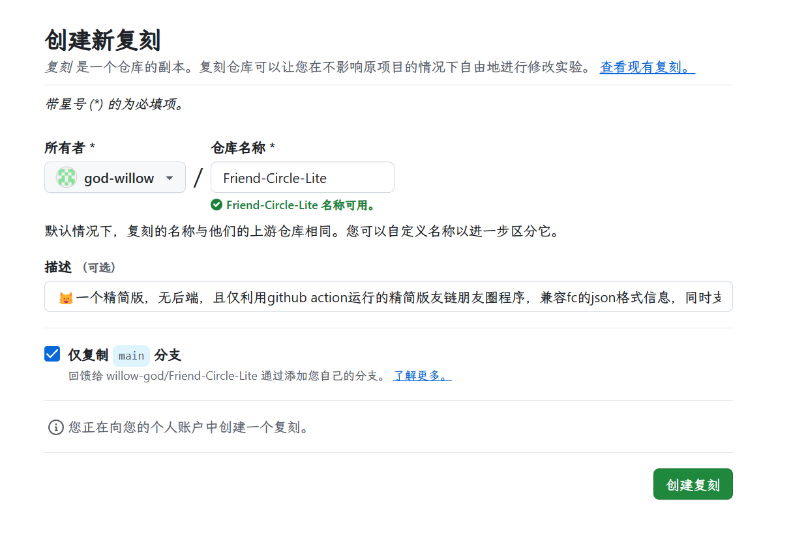
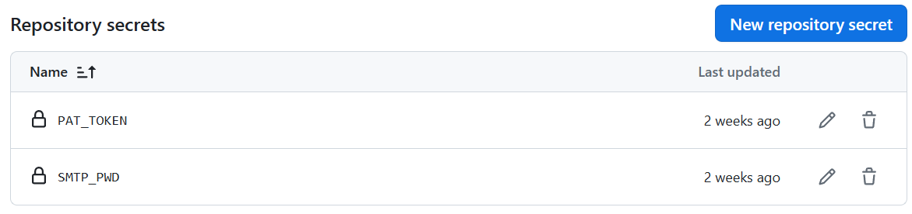
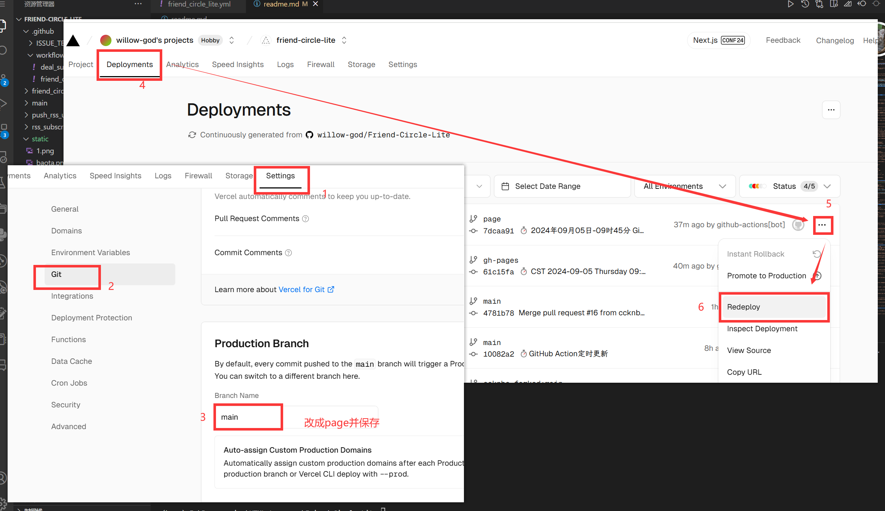
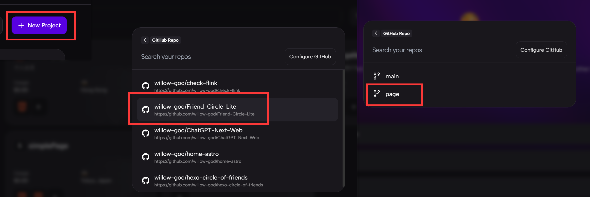
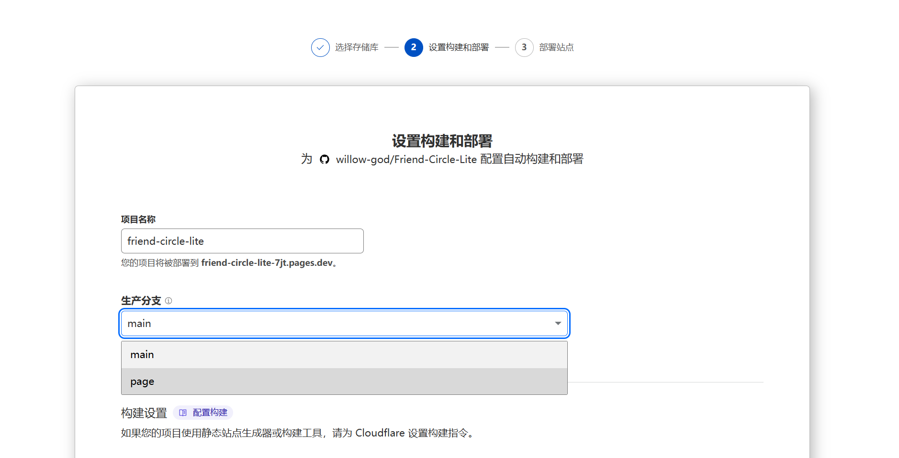
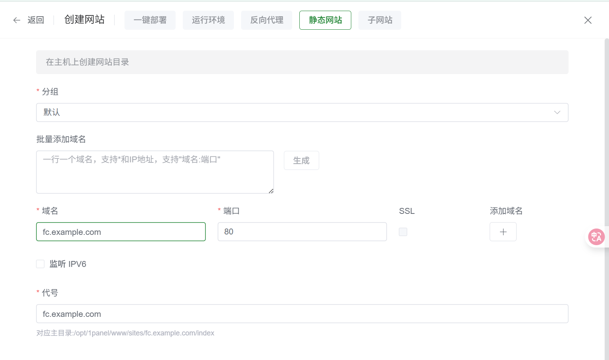
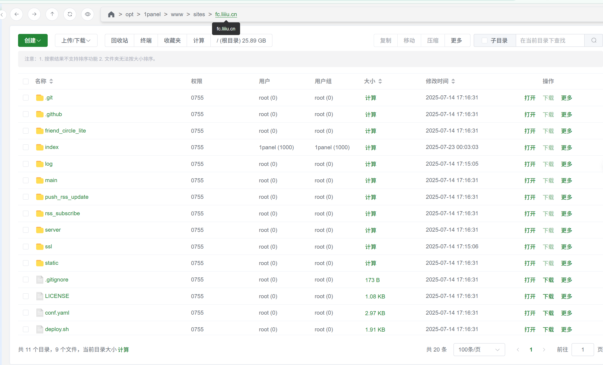
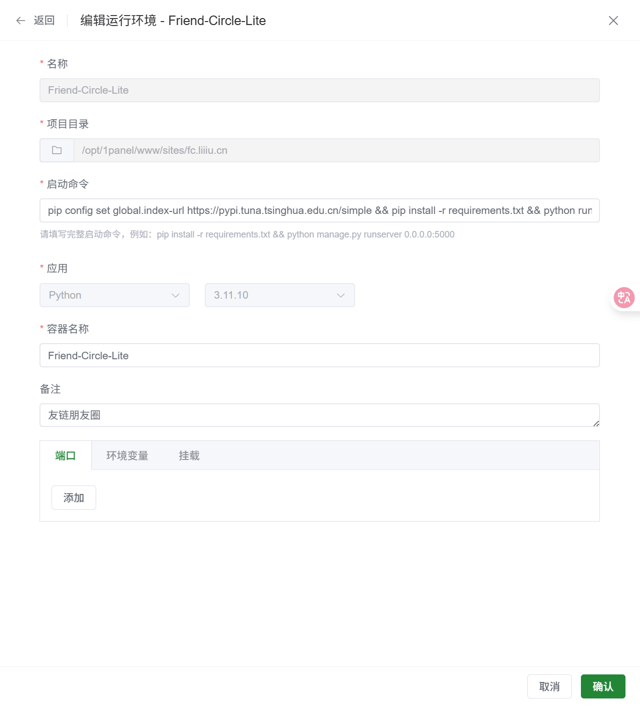
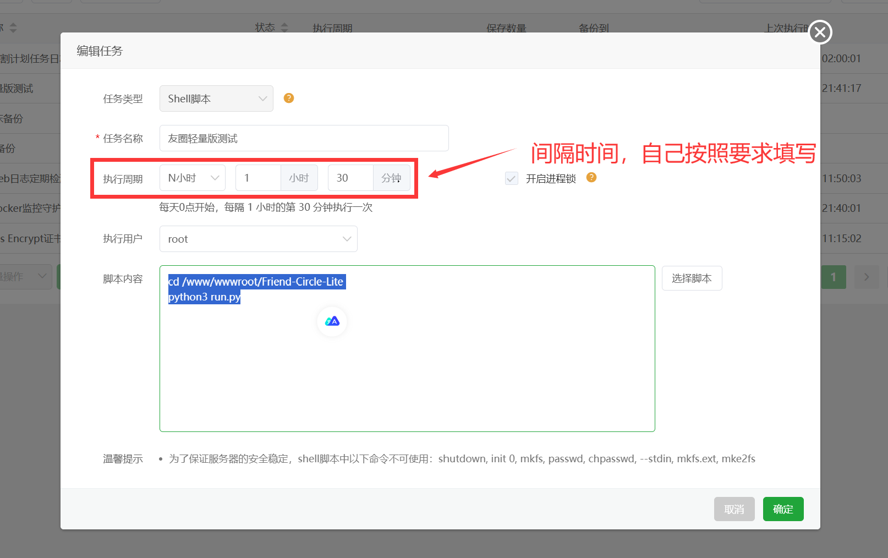

<div align="center">
  

  [前端展示](https://fc.liushen.fun) | [详细文档](https://blog.liushen.fun/posts/4dc716ec/)

  # Friend-Circle-Lite

</div>

友链朋友圈简单版，实现了[友链朋友圈](https://github.com/Rock-Candy-Tea/hexo-circle-of-friends)的基本功能，能够定时爬取rss文章并输出有序内容，为了较好的兼容性，输入格式与友链朋友圈的json格式一致，为了轻量化，暂不支持从友链页面自动爬取，下面会附带`hexo-theme-butterfly`主题的解决方案，其他主题可以类比。

## 开发进度

### 2026-06-27 - 检测缓存与重试节奏整理

本次主要整理了友链检测缓存和重试节奏，目标是减少长期异常站点带来的重复请求，尤其是 RSS 探测请求。

- **不可达时长改为按时间计算**：不再把失败次数当作“不可达天数”。SQLite 记录 `unreachable_since`，`link.json` 输出 `unreachable_days`，按持续时间向上取整，首次不可达显示为 1 天。
- **RSS 不可用状态单独入库**：新增 `rss_unavailable_since`，用于记录“站点可达，但 RSS 探测或解析失败”的持续起点。该字段只用于内部缓存和重试判断，不输出到 `link.json`。
- **动态降低重试频率**：长期异常站点会逐步降低检测频率：未满 10 天按默认缓存周期，10 天后 5 天检测一次，30 天后 10 天检测一次，60 天后最多 15 天检测一次。
- **减少 RSS 探测请求**：缓存复用发生在 RSS 探测之前。只要站点已有“RSS 不可用”缓存，并且未到动态重试窗口，就不会再次扫描 `/feed`、`/rss.xml`、`/atom.xml` 等候选地址。
- **输出保持克制**：`link.json` 继续面向前端展示，只保留可达性、可抓取性、不可达天数、最近文章时间等字段；RSS 不可用起点不暴露给前端。
- **SQLite 兼容升级**：旧缓存库会自动补齐新增字段；旧的 `fail_count` 列仅作为兼容遗留列保留，不再参与业务逻辑和 public JSON 输出。

<details>
<summary>查看更多</summary>

### 2026-06-08 - v2.1.0 优化更新

* **友链检测逻辑简化**：RSS 探测、主页可达性、反链检测统一由友链可达性检测流程维护，友圈抓取只读取可抓取 RSS 的缓存结果，减少重复请求。
* **配置项整理**：代理配置独立为 `proxy_settings.proxy_url`，建议通过仓库环境变量 `PROXY_URL` 覆盖；`link_check.enable` 旧字段仍兼容读取，但当前检测流程始终启用。
* **数据输出稳定**：`all.json` 保持友链朋友圈文章格式不变，友链可达性数据集中输出到 `link.json`；`link.json` 移除冗余的 `method`、`reason`、单站 `checked_at` 等展示字段。
* **调试能力增强**：新增 `debug` / `FCL_DEBUG` 开关，开启后会全量打印 SQLite 缓存并清理核心表残留旧字段，便于定位缓存问题。
* **首页展示重写**：`static/index.html` 改为国风单文件展示页，可在顶部切换友链可达性与友链朋友圈；`main/fclite.js` 和 `main/fclite.css` 保持不变，外部引用不受影响。

### 🎉 2026-05-31 - v2.0.0 重大更新

> **⚠️ 重要更新**：本次更新包含**数据结构变更**和**配置文件调整**，请查看 **[完整更新日志 (CHANGELOG.md)](./CHANGELOG.md)** 了解详情。
> 
> **✅ 兼容性更新**：保持向后兼容，旧版引用者无需修改代码，`all.json` 结构保持兼容，`main/fclite.js` 和 `main/fclite.css` 不变。

* **✨ 新增友链可达性检测功能**：合并 [check-flink](https://github.com/willow-god/check-flink) 项目，支持直连、代理、API 三种检测方式，并支持反链检测。
* **📊 数据结构重构**：友链可达性数据独立输出到 `link.json`，`all.json` 仅保留友圈文章数据，实现数据分离。
* **⚙️ 配置优化**：`merge_settings` 独立配置，友圈文章和友链可达性数据分别控制合并。
* **🎨 前端页面重写**：新首页继承 check-flink 风格，同时展示友链状态和友圈文章。
* **🔄 智能数据合并**：支持国内外数据源智能合并，可达性优先级、延迟、反链、失败次数均智能选择最优结果。

**详细说明**：[查看完整更新日志 →](./CHANGELOG.md)

### 请求节奏说明

默认 GitHub Actions 每 4 小时执行一次友链朋友圈任务，但友链可达性检测与 RSS 探测结果会按 `link_check.max_age_hours` 缓存，默认 24 小时。

也就是说：

- 友链可达性检测、RSS 探测、主页可达性、反链检测默认每天才会对同一站点重新检查一次。
- 如果某个站点没有 RSS，检测结果会缓存为不可抓取，接下来 24 小时内的友圈任务会直接跳过它，不会每 4 小时重复探测。
- 每 4 小时执行一次的友圈抓取会复用这份检测缓存，只请求 `crawlable=true` 且有 RSS 缓存的站点。
- 新增友链如果还没有进入缓存，会在当前轮次按友链数据单独参与匹配；完整检测结果会等到下一个 24 小时检测窗口统一写入缓存。

这样可以保留较高的文章更新频率，同时尽量减少对友链站点、RSS 地址和代理/API 的请求数量。

### 2026-05-25

* 合并友链可达性检测能力，检测结果会写入独立的 `link.json` 供前端按需获取，不可达或仅 API 可达的友链会跳过 RSS 抓取。

### 2026-05-24

* 移除原先基于 FastAPI 的简陋后端部署方式，后续自部署统一采用生成静态文件后作为纯静态网站托管的纯净态方式。

### 2025-07-23

* 添加缓存文件，防止由于缓存导致多次请求
* 添加feed.php后缀的适配
* 完善action，将临时文件统一缓存，包括缓存文件，和最新文章文件，缓存时间缩短为三十天

> 注意，本次更新由于变动了订阅文章地址，可能导致给所有邮件订阅用户发送五个最新文章邮件，如果想要避免，可以先将SMTP发件信息修改成错误的信息，防止成功发送邮件，等更新完成，成功执行一次获得最新文章，并缓存后再修改成正确的相关信息即可。

### 2024-10-29

* 完善github数据获取，从环境变量中直接获取，配置文件仅用于自部署
* 限制文章数量，防止因为数量过大导致的api文件加载缓慢，仅保留150左右文章([#23](https://github.com/willow-god/Friend-Circle-Lite/pull/23))
* 修改action中写错的github_token拼写

### 2024-10-07

* 添加随机文章刷新按钮
* 完善邮件通知模板自定义程度

<h3>2024-10-07</h3>

* 更新自部署的api地址，统一为all.json，提高js兼容性
* 美化展示页面UI(@JLinMr)，添加背景图片
* 优化作者卡片弹窗动效(@JLinMr)

<h3>2024-09-22</h3>

* 修复 #18 提出的，由于rss倒序导致限制抓取错误的问题，改为先全部获取后，按照时间排序，再选择性获取

<h3>2024-09-05</h3>

* 更新部署方式，将静态文件放到page分支下，主分支不放数据文件
* 前后端分离，部署方式不变但更加直观方便

<h3>2024-09-03</h3>

* 添加特定RSS选项，用于指定部分友链特殊RSS地址
* 更新文档，添加特定RSS选项配置部分

<h3>2024-08-28</h3>

* 日常维护，修复issue中提出的时间为空导致错误的情况，使用更新时间代替

<h3>2024-08-11</h3>

* 添加服务器部署的情况下，合并github结果的选项
* 由于复杂性，决定将服务和定时抓取分开，使用面板自带进行配置，防止小白无法配置
* 修改文档，添加自部署部分

<h3>2024-08-03</h3>

* 将自部署分离为API服务和定时爬取
* 尝试更加系统的启动脚本
* 删除server.py中的爬取内容，使用定时任务crontab实现

<h3>2024-07-28</h3>

* 自部署添加跨域请求 
* 修复内存占用异常问题
* 将html资源分开存放，实现更加美观的页面

<h3>2024-07-26</h3>

* 自部署添加跨域请求 
* 添加`/rss.xml`，`/feed/`，`feed.xml`接口的爬取，提高兼容性
* 修复PJAX下会多次出现模态框的问题，并且切换页面不消失
* 修复模态框宽度问题，添加日历图标以更加美观

<h3>2024-07-25</h3>

* 自部署正在开发中，仅供测试
* 添加`/errors.json`，用于获取丢失友链数据，提高自定义程度
* 添加`/index.xml`接口的爬取，提高兼容性
</details>


## 展示页面

* [清羽飞扬](https://blog.liushen.fun/fcircle/)

* [星港](https://blog.starsharbor.com/fcircle/)

* [梦爱吃鱼](https://blog.bsgun.cn/fcircle)

* [Aroes](https://homulilly.com/friends/)

* 欢迎在issue中[提交](https://github.com/willow-god/Friend-Circle-Lite/issues/20)以展示你独特的设计！

## 项目介绍

- **爬取文章**: 爬取可抓取 RSS 的友链文章，结果放置在根目录的 `all.json` 文件中，方便读取并部署到前端。
- **友链可达性检测**: 抓取前会统一维护 RSS 探测、主页可达性和反链检测缓存；检测结果单独输出到 `link.json`，友圈抓取会根据 `crawlable` 与 RSS 缓存决定是否抓取。
- **邮箱推送更新(对作者推送所有友链更新)**: 作者可以通过邮箱订阅所有rss的更新（未来开发）。
- **issue邮箱订阅(对访客实时推送最新文章邮件)**: 基于`GitHub issue`的博客更新邮件订阅功能，游客可以通过简单的提交`issue`进行邮箱订阅站点更新，删除对应`issue`即可取消订阅。
- **文件分离**: 将生成任务和静态展示分离，前端文件与生成后的 `all.json`、`link.json` 可直接作为静态网站托管。

## 特点介绍

* **轻量化**：对比原版友链朋友圈的功能，该友圈功能简洁，去掉了设置和 FastAPI 的臃肿，仅保留关键内容。
* **无数据库**：因为内容较少，我采用`json`直接存储文章信息，减少数据库操作，提升`action`运行效率。
* **部署简单**：原版友链朋友圈由于功能多，导致部署较为麻烦，本方案仅需简单的部署action即可使用，vercel仅用于部署前端静态页面和实时获取最新内容。
* **文件占用**：对比原版`4MB`的`bundle.js`文件大小，本项目仅需要`5.50KB`的`fclite.min.js`文件即可轻量的展示到前端。

## 功能概览

* 文章爬取
* 友链可达性检测
* 友链状态前端展示
* 暗色适配
* 显示作者所有文章
* 获取丢失友链数据
* 随机钓鱼
* 邮箱推送
* 美观邮箱模板
* 自部署(2024-08-11添加)
* 前端单开分支(2024-09-05添加) @CCKNBC

## action部署使用方法

### 前置工作

1. **Fork 本仓库:**
   点击页面右上角的 Fork 按钮，将本仓库复制到你自己的`GitHub`账号下，仅复刻main分支即可。
   

2. **配置 Secrets:**
   在你 Fork 的仓库中，依次进入 `Settings` -> `Secrets` -> `New repository secret`，添加以下 Secrets：
   - `SMTP_PWD`(可选): SMTP 服务器的密码，用于发送电子邮件，如果你不需要，可以不进行配置。

   
   
3. **配置action权限：**
   
   在设置中，点击`action`，拉到最下面，勾选`Read and write permissions`选项并保存，确保action有读写权限。
   
4. **启用 GitHub Actions:**
   GitHub Actions 已经配置好在仓库的 `.github/workflows/*.yml` 文件中，当到一定时间时将自动执行，也可以手动运行。
   其中，每个action功能如下：
   
   - `friend_circle_lite.yml`实现核心功能，爬取并发送邮箱，需要在Action中启用；
   - `deal_subscribe_issue.yml`处理固定格式的issue，打上固定标签，评论，并关闭issue；
   
5. **设置issue格式：**
   这个我已经设置好了，你只需要检查issue部分是否有对应格式即可，可以自行修改对应参数以进行自定义。

### 配置选项

如果需要修改爬虫、合并、友链检测或邮件模板等配置，请修改仓库中的 `conf.yaml` 文件。下面只列常用项，完整注释可以直接查看 `conf.yaml`。

- **调试开关**

  ```yaml
  debug: false
  ```

  默认关闭。开启后，程序结束前会全量打印 SQLite 缓存表结构与所有数据，并保守清理核心表残留旧字段。也可以使用仓库环境变量 `FCL_DEBUG=1` 临时开启。

- **爬虫相关配置**

  ```yaml
  spider_settings:
    enable: true
    json_url: "https://blog.liushen.fun/friend.json"
    article_count: 5
  ```

  `enable`：是否启用友链朋友圈抓取。

  `json_url`：你的友链 JSON 地址，仅支持网络地址。

  `article_count`：每个站点最多抓取的文章数量。

- **代理配置**

  ```yaml
  proxy_settings:
    proxy_url: ""
  ```

  程序会先直连，请求失败且配置了代理时自动走代理。`proxy_url` 涉及一定违规风险和隐私风险，请尽量不要直接写入配置文件，推荐在仓库环境变量 `PROXY_URL` 中配置。

  推荐填写代理前缀，例如：

  ```text
  https://proxy.example.com/
  ```

  程序会自动拼接为：

  ```text
  https://proxy.example.com/https://example.com/feed.xml
  ```

  如果需要自行搭建代理，可以参考：[使用 CF Workers 搭建反代加速器](https://blog.liushen.fun/posts/dd89adc9/)。

  也兼容 `https://proxy.example.com?url={url}` 这类高级格式，但普通反代场景不推荐这样写。

- **数据合并配置**

  ```yaml
  merge_settings:
    enable: false
    remote_base_url: "https://fc.liushen.fun"
    merge_article_data: true
    merge_link_check_data: true
  ```

  `enable`：是否启用数据合并。

  `remote_base_url`：远程数据源基础 URL，程序会自动拼接 `/all.json`、`/link.json`、`/errors.json`。

  `merge_article_data`：是否合并友链朋友圈文章数据。

  `merge_link_check_data`：是否合并友链可达性数据。

- **友链可达性检测配置**

  ```yaml
  link_check:
    max_age_hours: 24
    timeout: 15
    max_workers: 10
    status_api_url: "https://v2.xxapi.cn/api/status?url={url}"
    enable_backlink_check: true
    author_url: "blog.liushen.fun"
  ```

  友圈抓取依赖友链可达性检测，因此当前检测流程始终启用；旧配置中的 `link_check.enable` 会被兼容读取，但不再作为有效开关。

  `max_age_hours`：同一友链检测结果缓存时间，默认 24 小时。缓存未过期时会复用 RSS、主页可达性、反链等结果；没有 RSS 的站点也会在缓存期内直接跳过，避免每次友圈抓取都重新探测。

  `timeout`：单次网页请求超时时间。

  `max_workers`：并发检测数量。

  `status_api_url`：兜底状态码 API。API 只能确认状态码，无法提供页面内容，所以 API-only 结果只用于可达性展示，不参与 RSS 抓取。

  `enable_backlink_check`：是否检测对方友链页是否包含你的站点链接。

  `author_url`：你的站点域名，用于反链检测，建议只填写域名。

  友链数据兼容旧三字段和新四字段格式：

  ```json
  ["站点名称", "站点地址", "头像地址"]
  ["站点名称", "站点地址", "友链页地址", "头像地址"]
  ```

- **邮箱推送功能配置**

  暂未实现，预留用于将每天的友链文章更新推送给指定邮箱。

  ```yaml
  email_push:
    enable: false
    to_email: recipient@example.com
    subject: "今天的 RSS 订阅更新"
    body_template: "rss_template.html"
  ```

- **邮箱 issue 订阅功能配置**

  通过 GitHub issue 实现向提取的所有邮箱推送博客更新的功能。

  ```yaml
  rss_subscribe:
    enable: true
    github_username: willow-god
    github_repo: Friend-Circle-Lite
    your_blog_url: https://blog.liushen.fun/
    email_template: "./push_templates/default.html"
    website_info:
      title: "清羽飞扬"
  ```

  `enable`：开启或关闭，如果没有配置请关闭。

  `github_username`：GitHub 用户名，用来拼接 GitHub API 地址。

  `github_repo`：仓库名称，作用同上。

  `your_blog_url`：用来定时检测是否有最新文章，请确保你的网站可以被 FCLite 抓取到。

- **SMTP 配置**

  使用配置中的相关信息实现邮件发送功能。SMTP 密码不写入配置文件，Action 部署请使用 `SMTP_PWD` Secret。

  ```yaml
  smtp:
    email: notify@example.com
    server: smtp.example.com
    port: 465
    use_tls: true
  ```

- **特定 RSS 配置**

  用于指定特殊友链 RSS，名称需要与友链名称严格匹配。

  ```yaml
  specific_RSS:
    - name: "阮一峰"
      url: "http://feeds.feedburner.com/ruanyifeng"
  ```

  如果不需要也可以置空，但不要删除此项。

2. **贡献与定制:**
   欢迎对仓库进行贡献或根据需要进行定制。

**如果你配置正常，那么等action运行一次（可以手动运行）应该就可以在page分支看到结果了，检查一下，如果结果无误，可以继续看下一步**

### 友圈json生成

**注意，以下可能仅适用于hexo-theme-butterfly或部分类butterfly主题，如果你是其他主题，可以自行适配，理论上只要存在友链数据文件都可以整理为该类型，甚至可以自行整理为对应json格式后放到 `/source` 目录下即可，格式可以参考：`https://blog.qyliu.top/friend.json` **

1. 将以下文件放置到博客根目录：

   ```javascript
   const YML = require('yamljs')
   const fs = require('fs')
   
   let friends = [],
       data_f = YML.parse(fs.readFileSync('source/_data/link.yml').toString().replace(/(?<=rss:)\s*\n/g, ' ""\n'));
   
   data_f.forEach((entry, index) => {
       let lastIndex = 2;
       if (index < lastIndex) {
           const filteredLinkList = entry.link_list.filter(linkItem => !blacklist.includes(linkItem.name));
           friends = friends.concat(filteredLinkList);
       }
   });
   
   // 根据规定的格式构建 JSON 数据
   const friendData = {
       friends: friends.map(item => {
           return [item.name, item.link, item.avatar];
       })
   };
   
   // 将 JSON 对象转换为字符串
   const friendJSON = JSON.stringify(friendData, null, 2);
   
   // 写入 friend.json 文件
   fs.writeFileSync('./source/friend.json', friendJSON);
   
   console.log('friend.json 文件已生成。');
   ```

2. 在根目录下运行：

   ```bash
   node link.js
   ```

   你将会在source文件中发现文件`friend.json`，即为对应格式文件，下面正常hexo三件套即可放置到网站根目录。

3. (可选)添加运行命令到脚本中方便执行，在根目录下创建：

   ```bash
   @echo off
   E:
   cd E:\Programming\HTML_Language\willow-God\blog
   node link.js && hexo g && hexo algolia && hexo d
   ```

   地址改成自己的，上传时仅需双击即可完成。

   如果是github action，可以在hexo g脚本前添加即可完整构建，注意需要安装yaml包才可解析yml文件。

## 部署静态网站

首先，将该项目部署到vercel，部署到vercel等平台的目的主要是检测仓库变动并实时更新数据，及时获取all.json文件内容。任意平台均可，但是注意，部署的分支为page分支。

1. vercel 部署完成后，检查对应页面，如果页面中没有数据，且 `/all.json` 路径无法访问可能是部署到main分支了，可以通过 `setting-git-Production Branch` ，填写为page并重新进行部署即可
   
   

2. zeabur 可以在部署时直接选择分支：
   
   

3. CloudFlare Page 也可以在构建时即选择对应的分支，这里不再细讲。

   

部署完成后，你将获得一个地址，如果是通过vercel部署的，建议自行绑定域名。

检查 `https://example.com/all.json` 和 `https://example.com/link.json` 是否有数据，如果都有，则部署成功。

## 部署到你的页面

在前端页面的md文件中写入：

```html
<div id="friend-circle-lite-root"></div>
<script>
    if (typeof UserConfig === 'undefined') {
        var UserConfig = {
            // 填写你的fc Lite地址
            private_api_url: 'https://fc.liushen.fun/',
            // 点击加载更多时，一次最多加载几篇文章，默认20
            page_turning_number: 20,
            // 头像加载失败时，默认头像地址
            error_img: 'https://i.p-i.vip/30/20240815-66bced9226a36.webp',
        }
    }
</script>
<link rel="stylesheet" href="https://fastly.jsdelivr.net/gh/willow-god/Friend-Circle-Lite/main/fclite.min.css">
<script src="https://fastly.jsdelivr.net/gh/willow-god/Friend-Circle-Lite/main/fclite.min.js"></script>
```

其中第一个地址填入你自己的地址即可，**注意**尾部带`/`，不要遗漏。

然后你就可以在前端页面看到我们的结果了。效果图如上展示网站，其中两个文件你可以自行修改，在同目录下我也提供了未压缩版本，有基础的可以很便捷的进行修改。

## 自部署使用方法

自部署后续统一采用纯静态方式：本项目只负责定时生成 `all.json`、`link.json`、`errors.json` 等数据文件，生成完成后把 `static`、`main` 和数据文件作为静态网站托管即可，不再启动 FastAPI 后端服务。友链检测缓存会保存在 `temp/cache.sqlite3` 中，用于判断同一友链是否需要在 24 小时后重新检测；静态网站只需要发布生成后的 JSON 和静态资源。

如果你有一台境内服务器，你也可以通过以下操作将其部署到你的服务器上，操作如下：

### 前置工作

确保你的服务器有 Python 运行环境，以及定时任务 `crontab`、宝塔、1Panel 等任意一种可定时执行命令的工具。

首先克隆仓库并进入对应路径：

```bash
git clone https://github.com/willow-god/Friend-Circle-Lite.git
cd Friend-Circle-Lite
```

由于不存在 issue，所以不支持邮箱推送(主要是懒得分类写了，要不然还得从secret中获取密码的功能剥离QAQ)，请将除第一部分抓取以外的功能均设置为false。

安装抓取服务所需依赖：

```bash
pip install -r ./requirements.txt
```

### 生成静态文件

执行一次抓取命令：

```bash
python run.py
```

执行完成后，根目录会生成或更新 `all.json`、`link.json`、`errors.json` 等数据文件。将以下内容放到你的静态网站目录即可：

- `static/` 目录中的静态页面和资源
- `main/` 目录中的前端样式与脚本
- `all.json`、`link.json`、`errors.json` 数据文件

如果希望在宿主机上直接整理出可发布目录，也可以运行：

```bash
chmod +x ./deploy.sh
./deploy.sh
```

脚本会执行 `python3 run.py`，并将 `main`、`static`、`all.json`、`link.json`、`errors.json` 复制到 `pages/` 目录。将 `pages/` 目录作为静态网站根目录部署即可。部署完成后，检查 `/all.json` 和 `/link.json` 是否有数据，如果都有，则部署成功。

### 1Panel / Docker 环境

> 目前 Docker 部署方式和 1Panel 强相关；这里的思路是先在面板里跑一次生成命令，把生成后的静态文件放到网站目录，再按静态网站托管。

由于主包也用上了1Panel，所以捣鼓了一下，得益于1Panel可以方便的创建运行环境，所以可以基本做到无占用的API，因为除了执行action的时候，其他时间完全是纯静态的。

首先创建一个完全静态的网站，比如fc.example.com，如下：



打开网站目录，将fclite项目代码放置在以网站命名的文件夹下，注意看示例：



注意看上面的文件结构，不要搞错啦！其中默认的`index`等所有文件夹一定要保留，不要删掉！

然后再在左侧菜单，1Panel，运行环境，创建Python环境，配置如下所示：



其中运行目录为刚才看到的以网站命名的文件夹，其中名称可以按照自己的要求随意修改，仅为Docker名称，执行命令如下：

```bash
pip config set global.index-url https://pypi.tuna.tsinghua.edu.cn/simple && pip install -r requirements.txt && python run.py && mv -f all.json link.json errors.json index/
```

点击运行，如果正常，应该会执行一个docker实现抓取，并且在抓取完成后，docker关闭，而你的网站下的index文件夹内，应该就是最新的爬取的内容，直接静态部署即可，后面只需要定时启动docker，会自动执行抓取命令，抓取完成后也会自动关闭。

#### 合并github数据

你是不是以为 GitHub 数据没用了？并不是！因为有很多站长使用 GitHub Pages 等服务部署博客，这种服务可能无法被你的服务器抓取，此时你可以同时维护国内外两条线路，并合并文章数据与可达性数据。修改 `conf.yaml` 中的以下部分：

```yaml
merge_settings:
  enable: true
  remote_base_url: "https://fc.liushen.fun"
  merge_article_data: true
  merge_link_check_data: true
```
其中 `remote_base_url` 不需要填写具体 JSON 文件名，程序会自动请求 `/all.json`、`/link.json`、`/errors.json` 并合并结果。

### 定时抓取文章

#### 宿主机环境

> 宿主机环境只需要直接执行python ./run.py即可执行抓取

由于原生的 crontab 可能较为复杂，这里主要讲解宝塔面板添加定时任务，这样可以最大程度减少内存占用，其他面板服务类似：



点击宝塔右侧的定时任务后，点击添加，按照上图配置，并在命令中输入：

```bash
cd /www/wwwroot/Friend-Circle-Lite
python3 run.py
```

具体地址可以按照自己的需要进行修改，这样我们就可以做到定时修改文件内容了！然后请求api就是从本地文件中返回所有内容的过程，和爬取是分开的，所以并不影响！

#### 容器环境

如果是容器环境，只需要定时启动容器即可执行抓取，抓取完成后，容器自动停止，零占用内存，命令如下示例，主要就是容器名称：

```bash
docker restart Friend-Circle-Lite
```

## 问题与贡献

如果遇到任何问题或有建议，请[提交一个 issue](https://github.com/willow-god/Friend-Circle-Lite/issues)。欢迎贡献代码！

## Star增长曲线

[](https://star-history.com/#willow-god/Friend-Circle-Lite&Timeline)
